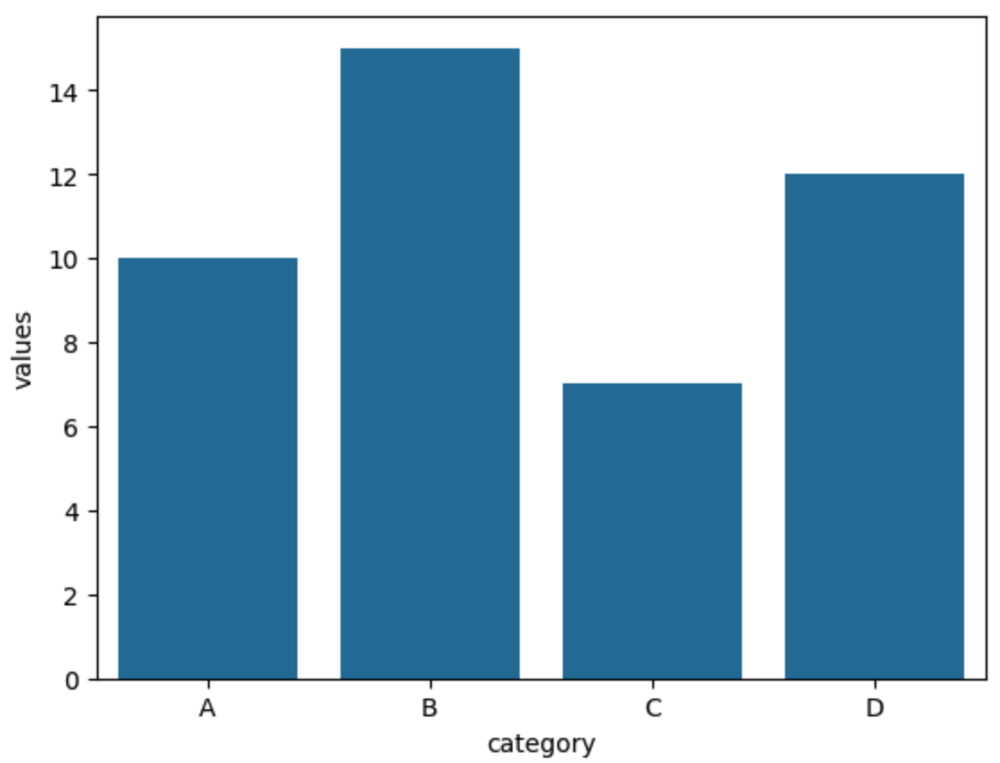
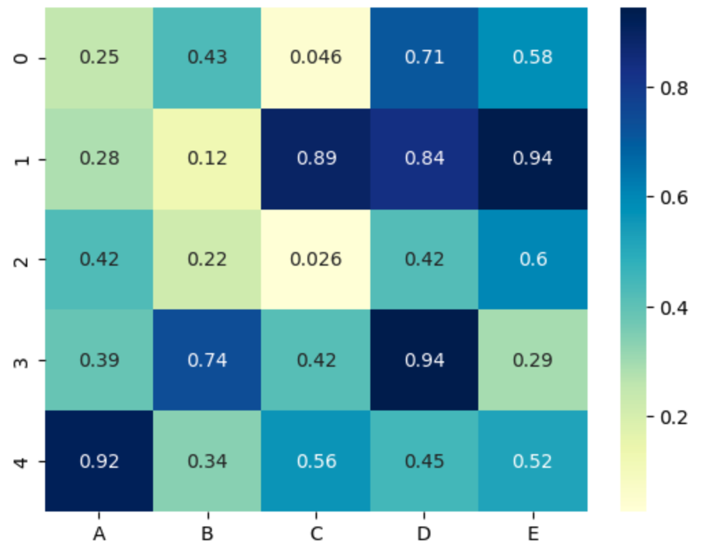

 | Function | Purpose |
 |----------|----------|
 | sns.barplot() | Bar charts with statistical aggregation |
 | sns.histplot() | 	Histograms for distribution visualization |
 | sns.boxplot() | Box-and-whisker plots for outlier detection |
 | sns.violinplot() | Combines boxplot and KDE for distribution |
 | sns.scatterplot() | Scatter plots for relationships |
 | sns.lineplot() | Line graphs for trends over time |
 | sns.heatmap() | Correlation heatmaps & matrix visualizations |
 | sns.pairplot() | Scatterplot matrix for pairwise relationships |
 | sns.lmplot() | Linear regression plots |


All the code below can be cut-and-pasted in single cells in https://colab.research.google.com/


## Barplot

```python
import matplotlib.pyplot as plt
import pandas as pd
import seaborn as sns

# Sample Data
data = pd.DataFrame({
    "category": ["A", "B", "C", "D"],     # First dataframe's column
    "values": [10, 15, 7, 12]             # Second dataframe's column
})

# Create Bar Plot
sns.barplot(x="category", y="values", data=data)

# Show the Plot
plt.show()
```

{style="width:40%"}

## Heatmap

```python
import matplotlib.pyplot as plt
import numpy as np
import pandas as pd
import seaborn as sns

# Create a DataFrame
data = pd.DataFrame(np.random.rand(5, 5), columns=["A", "B", "C", "D", "E"])  # (1)!

# Heatmap using DataFrame
sns.heatmap(data, annot=True, cmap="YlGnBu")  # (2)!

plt.show()
```

1.  np.random.rand(5, 5): Generates a 5x5 matrix of random values between 0 and 1.
2.  sns.heatmap(): Creates the heatmap.
    annot=True: Displays numerical values inside the cells.
    cmap="coolwarm": Sets the color map (you can try others like "viridis", "Blues", "magma", etc.)

{style="width:40%"}
